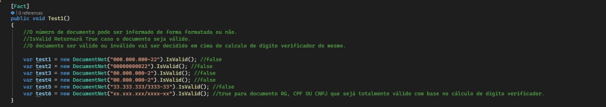

Sobre o projeto

Documento.Net é um pacote criado com o objetivo de validar um documento via calculo de DV(dígito verificador)
Atualmente os documentos suportados são: RG, CPF e CNPJ.

O projeto foi desenvolvido em .NET Standard2.0 visando atender questões de compatibilidade entre diferentes versões do ecossistema .Net

Pacote Nuget: https://www.nuget.org/packages/DocumentoNet.NuGet/

## Como usar

Após instalar o pacote via Gerenciador de pacotes Nuget no VisualStudio, basta fazer a importação do NameSpace Documento.Net

Como na imagem, basta fazer a instanciação de um objeto DocumentNet e passar como parâmetro o número do documento como string.
Não existe necessidade de fazer formatação do campo, do jeito que o documento for inputado, a biblioteca vai saber se virar.

